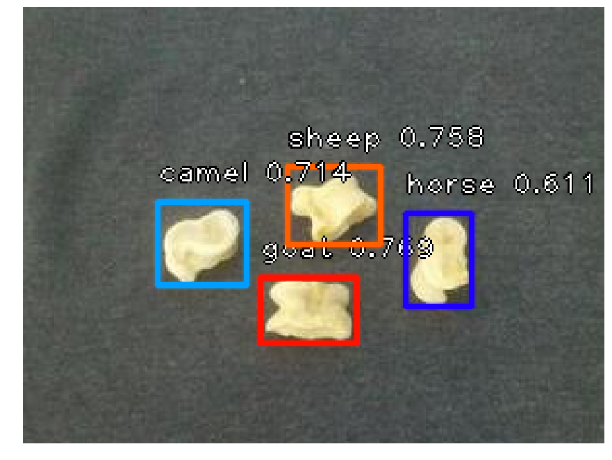

# Шагайны дүрс таних

Гүн сургалтын (Deep Learning) арга ашиглан, зургаас шагайн хэлбэрийг таних моделийг [Deep Learning UB 2018](https://www.facebook.com/events/1918739155078866/) зуны сургалтын хүрээнд сургаж, туршсан. Танилтыг объект илрүүлэх хурдан бөгөөд нарийвчлал өндөртэй загваруудын нэг болох [RetinaNet](https://arxiv.org/abs/1708.02002)-ийг хэрэглэсэн.

> [!NOTE]
> Туршлагагүйтэж, шалгалтын өгөгдөл хуваахдаа буруу хувааж (зургаар нь бус объектоор нь), тайланд бичсэн загвараа сургасан байна. Шинээр үүсгэсэн COCO хэлбэрт оруулсан [`annotations.json`](ankle_bones_dataset/annotations.json)-г хэрэглэнэ үү.



## Хэрэглэх нь

1. `pip install -r requirements.txt` шаардлагатай сангуудыг суулгана. (GPU ашиглах бол `tensorflow`-г `tensorflow-gpu` болгон өөрчлөөрэй)
2. `$ jupyter notebook` jupyter дэвтрийн серверийг асаана.
3. `abr_test.ipynb` руу орж сургасан модель болгон шалгах зургуудын байршлыг тохируулан ажиллуулна.

## Сургах нь

1. `pip install -r requirements.txt` шаардлагатай сангуудыг суулгана.
2. Jupyter notebook ашиглах бол `$ jupyter notebook` jupyter дэвтрийн серверийг асаана.
3. Jupyter дэвтэр ашиглах бол `abr_train.ipynb` дэвтрийг ашиглан шинэ модель сургана. Хэрэв дэвтэр ашиглахгүй бол `train.py` файлыг ашиглана.
4. `abr_train.ipynb` эсвэл `train.py` доторх параметруудыг сургалтандаа тохируулан өөрчилж сургалтаа эхэлнэ.

## Хэрэгцээт файлууд

Dataset: [Hugging Face](https://huggingface.co/datasets/bilguun/shagai)
(Raw: [Google Drive (Зургууд)](https://goo.gl/Uq856R), тэмдэглэгээг `ankle_bones_dataset/annotations.json`-с авна уу.)

Сургасан модель: [Google Drive](https://goo.gl/cYiXno)

Тайлан: [Google Drive](https://drive.google.com/file/d/1EisMI_l8QjH7fdeNNW0KtFUrMStzM_aG/view?usp=sharing)

## Credits

This dataset was created with contributions from Amarsaikhan Batjargal, Bandikhuu Baasanjav, and Bilguun Ochirbat, students of the National University of Mongolia.

## Citation

```bibtex
@misc{shagai2018,
  author = {Ochirbat, Bilguun and Batjargal, Amarsaikhan and Baasanjav, Bandikhuu},
  title = {{Detect the shape of shagai using RetinaNet}},
  howpublished = {\url{https://github.com/bilguun0203/ankle-bone-recognition}},
  year = {2018},
  month = {July}
}
```
